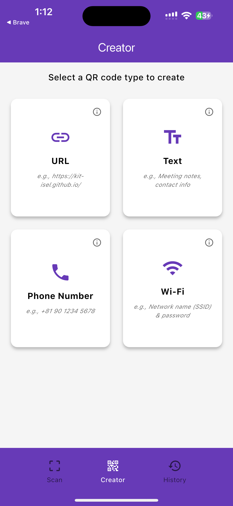
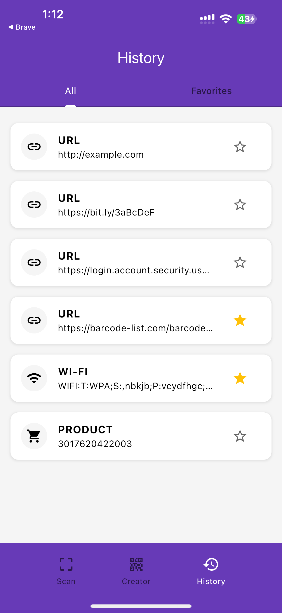
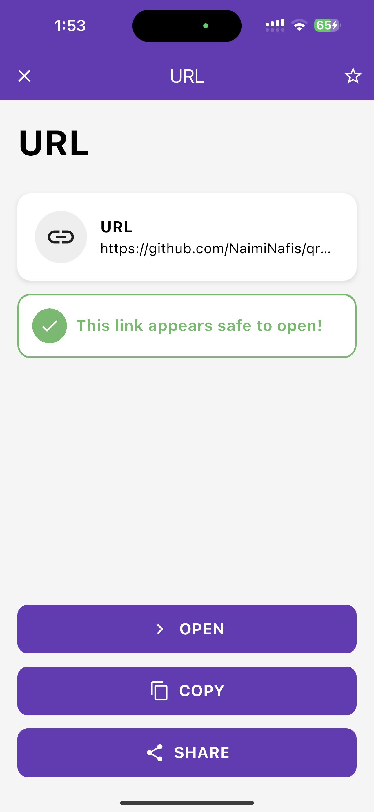
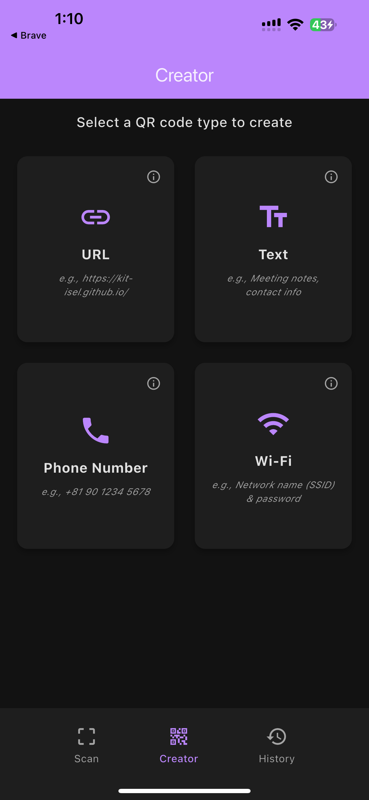
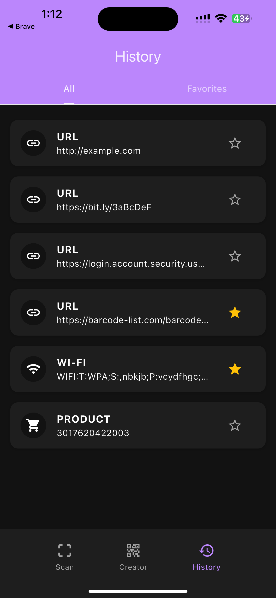
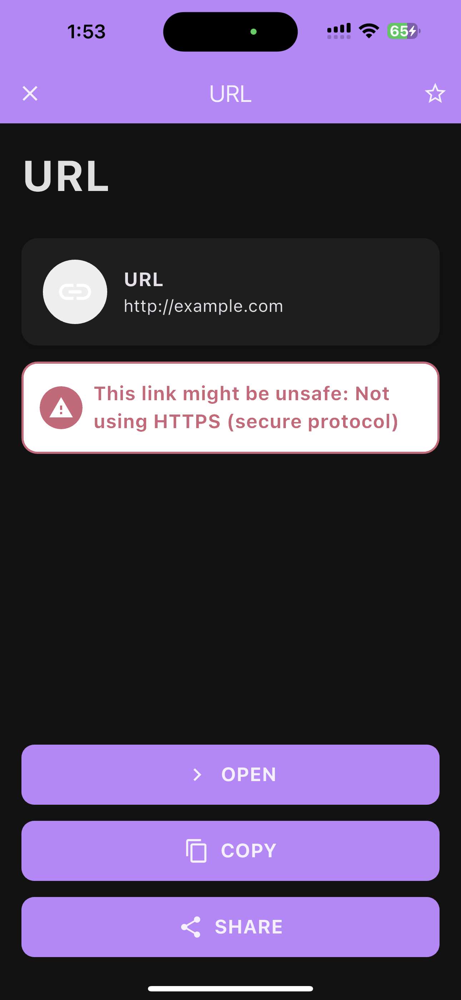

# 🔎 QRious
<p align="center">
  
</p>

<p align="center">
  <a href="https://flutter.dev/">
    
  </a>
  <a href="LICENSE">
    
  </a>
  <a href="https://github.com/NaimiNafis/QRious">
    
  </a>
</p>

QRious is a modern QR code utility built with Flutter, focusing on security, privacy, and user experience. Unlike many scanners, it includes proactive checks for malicious URLs and performs all operations on-device, ensuring your data remains private.

## ✨ Features

- **Scan QR codes** with your camera
- **Generate QR codes** for URLs, text, phone numbers, and Wi-Fi
- **Security checks** for potentially harmful URLs
- **Save & organize** your scan history
- **Customize** QR code appearance
- **Dark mode** support

## 📱 Screenshots

### Light Mode
<p align="center">
  
  
  
  
</p>

### Dark Mode
<p align="center">
  
  
  
  
</p>

## 🛠️ Built With

- **Flutter** - The primary framework for building the app
- **Provider** - For state management following MVVM architecture
- **mobile_scanner** - For accessing the device camera to scan QR codes
- **url_launcher** - For opening links from scanned QR codes
- **sqflite** - Local database for storing scan history
- **image_picker** - For selecting images containing QR codes
- **share_plus** - For sharing generated QR codes

The app follows the MVVM (Model-View-ViewModel) architecture pattern with a clean separation of concerns between data, business logic, and UI components.

## 🚀 Quick Start

### Prerequisites

- Flutter SDK (^3.7.2)
- Dart SDK
- Android Studio / VS Code
- iOS Simulator / Android Emulator / Physical Device

### Installation

1. **Clone the repository**
   ```bash
   git clone https://github.com/NaimiNafis/QRious
   cd QRious
   ```

2. **Install dependencies**
   ```bash
   flutter pub get
   ```

3. **Run the app**
   ```bash
   flutter run
   ```

## 🔒 Privacy & Security

- All processing is done **locally** on your device
- **No data is sent** to any external servers
- Built-in security checks warn about potentially unsafe URLs
- Camera access only when actively scanning

## 🔧 Troubleshooting

### iOS Build Issues

If you encounter pod install issues, try:
```bash
flutter clean
flutter precache --ios --force
cd ios && pod install && cd ..
```

### Android Permissions

If camera doesn't work, check that you've granted camera permission in your device settings.

## 💡 Contributing

Contributions are welcome! For more details about the app's architecture and implementation, check [appcore.md](appcore.md).

1. Fork the repository
2. Create your feature branch (`git checkout -b feature/amazing-feature`)
3. Commit your changes (`git commit -m 'Add some amazing feature'`)
4. Push to the branch (`git push origin feature/amazing-feature`)
5. Open a Pull Request

## 📄 License

This project is licensed under the MIT License - see the [LICENSE](LICENSE) file for details.

## 📩 Contact

Naimi Nafis: [Github](https://github.com/NaimiNafis) | [Portfolio](https://naiminafis.github.io/portfolio/)

isel-yoshii: [Github](https://github.com/isel-yoshii)
